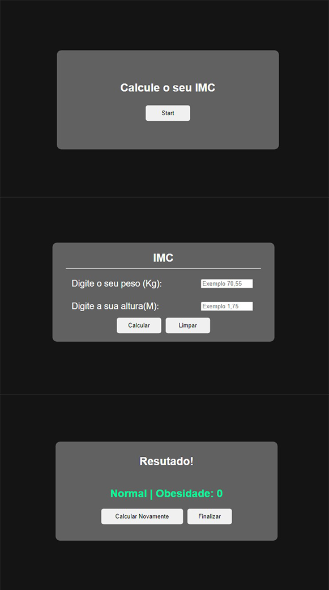

<h1 align="center"> CALCULADORA IMC </h1>

<h2>OBJETIVO</h2>

Criar uma calculadora imc com o objetivo de ampliar os conhecimentos em JavaScript, criando funções e manipulando inputs.

Para esse projeto usei HTML, CSS e JavaScript.

<h2> RESULTADO</h2>

<h2>ACESSE</h2>

(https://tstavale.github.io/calculadora_imc/)

<h2>FERRAMENTAS</h2>

<ul>
  <li>HTML</li>

  <li>CSS</li>

  <li>JavaScript</li>

</ul>

